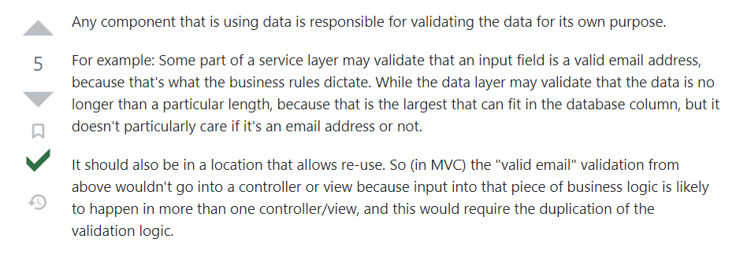

# Validation with Spring Boot

### What is validation under Spring Boot

TODO: 

<ul>
    <li>To finish this section.
</ul>

### On what application layer should it be validation?

### Links

- [Validation with Spring Boot - the Complete Guide](https://reflectoring.io/bean-validation-with-spring-boot/)