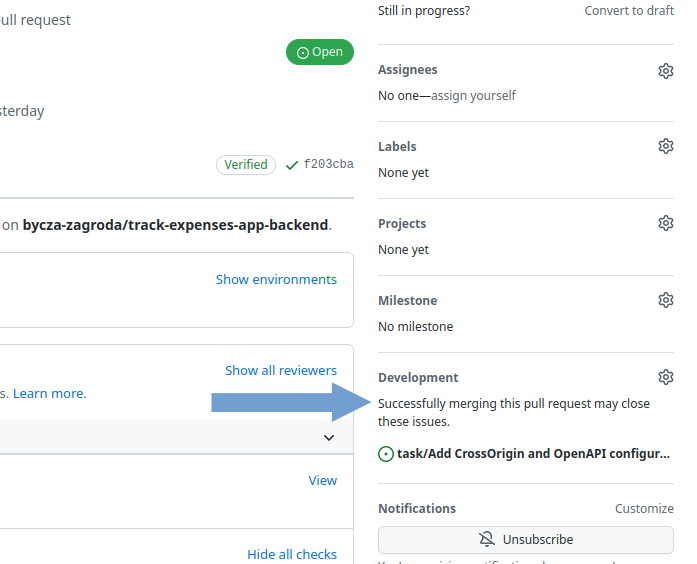

[Angielski](GITHUB_WORK.md) - [<ins>Polski</ins>](GITHUB_WORK.pl.md)

# Jak pracujemy z GitHub'em

* [Rozpoczęcie pracy nad zadaniem](#Rozpoczęcie-pracy-nad-zadaniem)
  - [Gita](#gita)
  - [IntelliJ IDEA](#intellij-idea)
* [Rozwiązywanie konfliktów](#Rozwiązywanie-konfliktów)
* [Code review](#code-review)
* [Ukończenie zadania](#Ukończenie-zadania)

## Rozpoczęcie pracy nad zadaniem

1. Przejdź do [strony z repozytorium](https://github.com/bycza-zagroda/track-expenses-app-backend) i wybierz **fork**


---

2. Rozwiń listę dostępnych branchy i wybierz **View all branches**


---

3. Stwórz nowy branch o nazwie odpowiadającej poniższemu nazewnictwu ↓

- **_feature/numberOfIssue-name-Of-Issue_** dla zadań dodających nowe funkcjonalności. Na przykład:
   feature/22-Domain-structure-of-money-wallet
- **_bugfix/numberOfIssue-name-Of-Issue_** -  dla zadań, które naprawiają błędy. Na przykład: 
    bugfix/22-Domain-structure-of-money-walle


⚠ Upewnij się że wybierasz gałąź **_develop_** jak źródłową

## Lokalne repozytorium

1. Sklonuj repozytorium używając

### Gita

`git clone https://github.com/bycza-zagroda/track-expenses-app-backend.git`

### IntelliJ IDEA


---

2. W cmd lub powershellu wykonaj poniższą komendę: (flag `--allow-empty` [pozwala na commitowanie bez zmian])

```shell
git commit -m "getting started" --allow-empty
git push
```

---

3. Wróć na [główną stronę projektu na GitHubie](https://github.com/bycza-zagroda/track-expenses-app-backend) i wybierz **_Pull requests_** -> **_New pull request_**.


---

4. Wybierz nowo utworzoną gałąź jako źródłową np. **_feature/task-1_** oraz 
**_develop_** jako gałąź docelową i kliknij **_Create pull request_**.


5. Upewnij się że na następnej stronie prawidłowo ustawiono branche (develop w repozytorium projektu, nowo utworzony w twoich) oraz że wybrano `Create draft pull request` i kliknij przycisk Draft pull request.  


---

Po utworzeniu pull requesta powiąż go z odpowiednim issue. Zrobisz to w sekcji Development. 



Od teraz możesz zacząć pracę nad zadaniem!

## Komity
Wiadomości w komitach powinny być pisane zgodnie z poniższym rysunkiem. 
Na przykład komit dla nowej funkcjonalności powinien być w j. angielskim i przypominać: "add new image: 
img009_commits_message.png to the documentation.


Dodatkowo, jeśli to code review zaczynamy od: "code review: message for code review"

## Rozwiązywanie konfliktów
[oparte na github docs](https://docs.github.com/en/pull-requests/collaborating-with-pull-requests/working-with-forks/syncing-a-fork)

### Instrukcja dla deweloperów
Przed wysłaniem zmian należy rozwiązać konflikty o ile takie się pojawią.
1. Sprawdz czy jest ustawione repozytorium upstream.
```shell
git remote -v

origin  git@github.com:[YOUR-GITHUB-NAME]/[REPOSITORY-NAME].git (fetch)
origin  git@github.com:[YOUR-GITHUB-NAME]/[REPOSITORY-NAME].git (push)
upstream        https://github.com/bycza-zagroda/[REPOSITORY-NAME].git (fetch)
upstream        https://github.com/bycza-zagroda/[REPOSITORY-NAME].git (push)
```

Jeżeli nie widać wpisów upstream należy wykonać następujące polecenie (jako `upstream-repository` należy podać `track-expenses-app-backend` albo `track-expenses-app-frontend`):

```shell
git remote add upstream https://github.com/bycza-zagroda/[REPOSITORY-NAME].git
```
2. Pobierz dane z repozytorium upstream.
```shell
git fetch upstream
```
3. Przełącz się na branch develop na swoim repozytorium (fork).
```shell
git checkout develop
```
4. Scal upstream/develop na swój lokalny branch develop a następnie wypchnij zmiany do zdalnego repozytorium (fork).
```shell
git merge upstream/develop
git push origin develop
```
5. Przełącz się lokalnie na odpowiedni branch - w poniższym przykładzie jest to `feature/1-feature-name`

```shell
git checkout feature/1-feature-name
```
6. Scal zmiany z brancha `develop` do brancha `feature/1-feature-name`.

```shell
git merge develop
```
Jeżeli nie pojawiły się błędy, można wysłać branch `feature/1-feature-name` do repozytorium zdalnego (fork).

Jeżeli istnieją konflikty ukaże się komunikat jak poniżej:

```shell
Aktualizowanie b73c31c..ceeb96d
error: Scalenie nadpisałoby zmiany w następujących plikach:
        MyClass.java
Złóż swoje zmiany lub dodaj do schowka zanim je scalisz.
Przerywanie
```

W takim przypadku należy przed wysłaniem kodu do repozytorium rozwiązać konflikty.

#### Rozwiązywanie konfliktów przy użyciu IntelliJ

W IntelliJ pliki z konfliktami są wyświetlane w oknie projektu na czerwono. Po otwarciu takiego pliku widzimy które linie wymagają rozwiązania konfliktów.    


Można użyć edytora IntelliJ do scalenia zmian i rozwiązania konfliktów. 

Należy kliknąć prawym klawiszem myszy na pliku i z menu wybrać Git->Resolve Conflicts


Po wybraniu tej opcji pojawi się okno `Conflicts`


Po kliknięciu przycisku `Merge` otwiera się okno edytora konflików.


Widzimy tutaj trzy panele: lewy pokazuje lokalną wersję, prawy - wersję z upstream, środkowy - wersję po scaleniu. 
Należy wybrać czy zachowujemy zmiany z lokalnej wersji, zmiany z upstream czy też tworzymy nową wersję, która 
zawiera zmiany z obu tych wersji. 
Po rozwiązaniu wszystkich konfliktów kilkamy przycisk `Applay`


Ostatni krok to wysłanie zmian do naszego repozytorium. 

```shell
git commit -m "merging with upstream"
git push
```
I tak oto rozwiązaliśmy konflikty w projekcie. 

## Code review

Code Review zaczynamy od otworzenia **_draft pull request_** i oznaczając je jako **_Ready for review_**


## Ukończenie zadania

Twój kod zostanie sprawdzony przez innego developera i lidera zespołu. Jeżeli zostaną zgłoszone uwagi co do kodu, 
implementujący zadanie developer je poprawia. Kod zostanie zmergowany, dopiero gdy wszystkie gitAction są zakończone pomyślnie.
